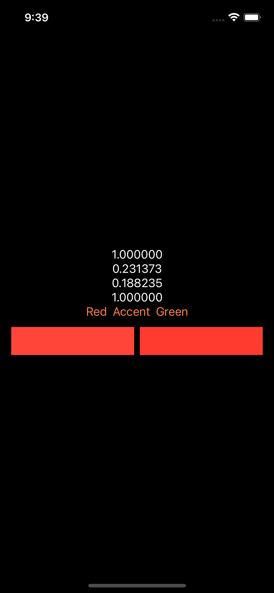
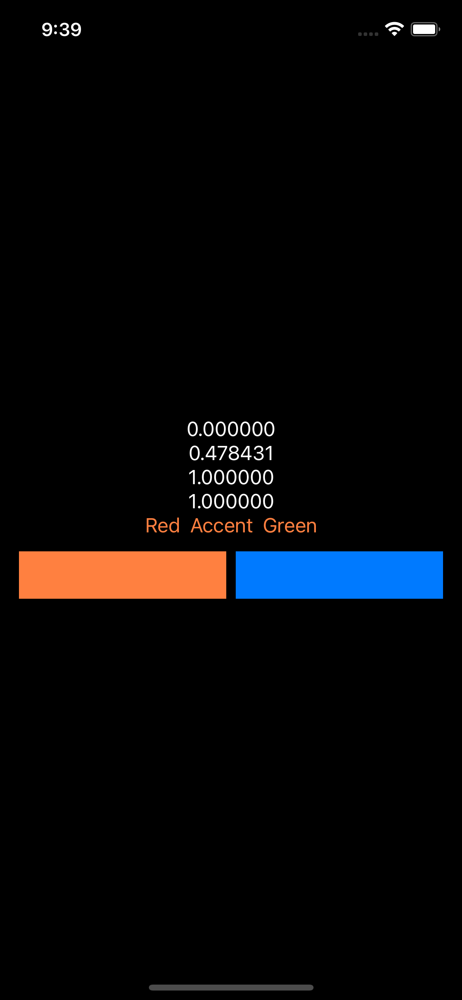
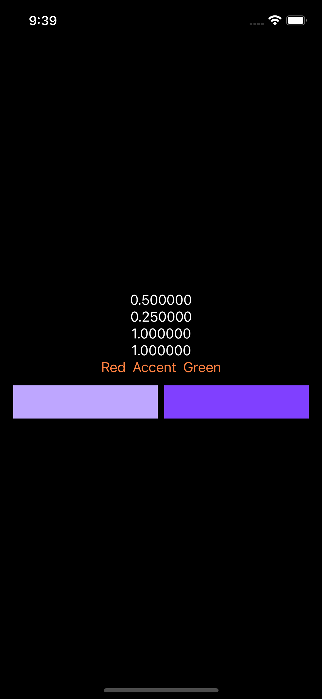
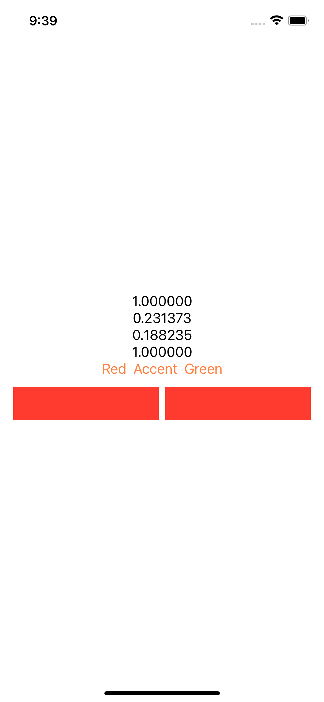
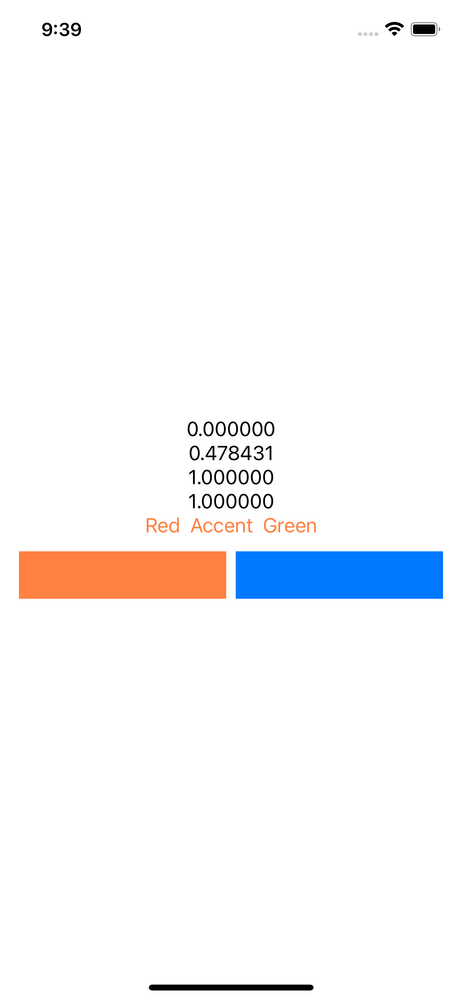
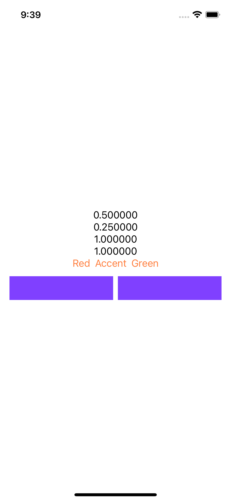

# GetComponents

Getting the wrong component values from Color, when it comes from xcassets:

| | | |
|:-------------------------:|:-------------------------:|:-------------------------:|
|||
|||

